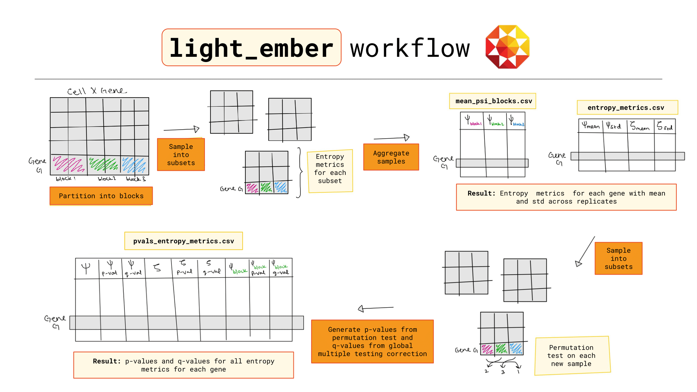

# ember
ember is a python and command line tool that can identify highly specific genes to a given partition (e.g., Age, Genotype, Cell type, etc.) in high-dimentional single cell RNA sequencing data. For an overview of how ember works, refer to [the ember guide (slides)](./assets/ember_guide.pdf).

<p align="center">
  
</p>

For a hands on tutorial, check out this [collab notebook](https://colab.research.google.com/drive/1OSMu27FiXWf1a1KFhAZ0fnbgMtLbH9YU?usp=sharing).

## Installation
You can install the package from github using pip:

```bash
pip install git+https://github.com/pachterlab/ember.git
````
We reccommned using ember in a fresh conda environment to avoid depnendency issues:

```bash
conda create -n ember_env python=3.10
conda activate ember_env
pip install git+https://github.com/pachterlab/ember.git
````

Import in python/Jupyter

```bash
import ember
````

Import specific function in python/Jupyter

```bash
from ember.light_ember import light_ember
from ember.generate_pvals import generate_pvals
from ember.plots import plot_partition_specificity, plot_block_specificity, plot_sample_counts, plot_psi_blocks
from ember.top_genes import highly_specific_to_block, highly_specific_to_partition, non_specific_to_partition
````
Run in commandline
```bash
ember --help
````

An example workflow in commandline
```bash
#Run full workflow with 4 cores to find genes that are specific to Genotype in a given dataset
ember light_ember test_adata_cwc22.h5ad Genotype ~/output/ --sample_id_col Mouse_ID --category_col Genotype --condition_col Sex --n_cpus 4

#You find that Cwc22 is expressed highly in the mouse genotype WSBJ so you want to generate p-values for psi_WSBJ
ember generate_pvals test_adata_cwc22.h5ad Genotype ~/output/ ~/output Mouse_ID Genotype Sex --block_label WSBJ --n_cpus 4

#Extract marker genes for WSBJ mice
ember highly_specific_to_block Genotype WSBJ pvals_entropy_metrics_Genotype_WSBJ.csv output/ --psi_thresh 0.6 --psi_block_thresh 0.7

# Find genes that are non-specific by genotype
ember non_specific_to_partition Genotype pvals_entropy_metrics_Genotype.csv output/ --psi_thresh 0.6 --zeta_thresh 0.2

#Visualize which genes are most and least specfic to Genotype
ember plot_partition_specificity Genotype ~/output/pvals_entropy_metrics_Genotype_WSBJ.csv ~/output/

#Visualize which genes are most specfic to the genotype WSBJ and highlight Cwc22 to see how good a marker it is compared to the other genes
ember plot_block_specificity Genotype WSBJ ~/output/pvals_entropy_metrics_Genotype_WSBJ.csv ~/output/ --highlight_genes Cwc22

#See how specific Cwc22 is to the other genotypes in your experiment. And increase font size to 30 so your advisor can see better!
ember plot_psi_blocks Cwc22 Genotype ~/output/Psi_block_df/ ~/output/ --fontsize 30

#Remind yourself how many individuals there are with the genotype WSBJ in your dataset compared to the other genotypes. Generate a descriptive plot of your whole experimental design to put things in persepctive. 
ember plot_sample_counts test_adata_cwc22.h5ad ~/output Mouse_ID Genotype Sex 

````


## Documentation

For more detailed information, refer to the [official documentation](./assets/ember_documentation.pdf).


## License

This project is licensed under the [BSD-2 License](./LICENSE).

