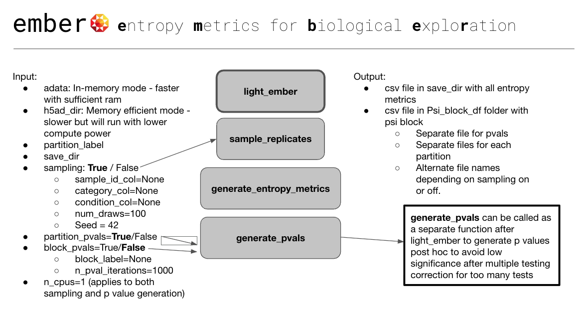

<p align="center">
  
</p>


## `light_ember()`

This is the main workflow function in `ember`. It loads in an h5ad file as an Anndata object using either in-memory mode (use `adata`) or memory-efficient mode (use`h5ad_dir`) and computes entropy metrics (&Psi;, &Zeta; and &Psi;<sub>block</sub> ) for a given partition label, optionally performs balanced sampling across experimental replicates, and generates permutation-based p-values to assess statistical significance of entropy metrics.

Entropy metrics generated: 

  * **&Psi;**: Fraction of information explained by the partition of choice.
  * **&Psi;<sub>block</sub>**: Specificity of information to a block.
  * **&Zeta;**: Specificity to a partition; the distance of the &Psi;<sub>block</sub> distribution from uniform.

***

### Installation
```python
!pip install git+https://<enter github PAT>@github.com/pachterlab/ember.git

````

### Usage Example

```python
import ember
from ember.light_ember import light_ember

light_ember(
    h5ad_dir = 'subset_dev_kidney.h5ad',
    partition_label = 'Age',
    save_dir = '/content/output',
    sampling=True,
    sample_id_col= 'sample_id',
    category_col='Age',
    condition_col='sex',
    num_draws=50,
    partition_pvals=False,
    block_pvals=False,
    n_cpus=2
)
````


### Parameters

| Parameter | Type | Description | Default |
| :--- | :--- | :--- | :--- |
| **`adata`** | AnnData | **Either adata or h5ad_dir required.** An AnnData object already loaded in memory. Use this or `h5ad_dir`. In-memory mode - faster with sufficient RAM| `None` |
| **`h5ad_dir`** | str | **Either adata or h5ad_dir required.** Path to the `.h5ad` file to process. Use this or `adata`. Memory efficient mode - slower but will run with lower compute power.| `None` |
| **`partition_label`** | str | **Required.** Column in `.obs` to group cells by (e.g., 'celltype, genotype'). | `None` |
| **`save_dir`** | str | **Required.** Path to the directory where results will be saved. | `None` |
| `sampling` | bool | If `True`, performs balanced sampling. The next three parameters are then required. | `True` |
| `sample_id_col` | str | Column with unique sample/replicate IDs (e.g., 'sample\_id'). | `None` |
| `category_col` | str | Column defining primary groups to balance within (e.g., 'mouse\_strain'). | `None` |
| `condition_col` | str | Column with conditions to balance across within each category (e.g., 'sex'). | `None` |
| `num_draws` | int | Number of balanced subsets to generate if sampling. | `100` |
| `seed` | int | Random seed for reproducible sampling. | `42` |
| `partition_pvals` | bool | If `True`, computes p-values for the main partition. | `True` |
| `block_pvals` | bool | If `True`, computes p-values for a specific block within the partition. | `False` |
| `block_label` | str | A specific value from `partition_label` to use for block p-value tests. Required if `block_pvals=True`. | `None` |
| `n_pval_iterations` | int | Number of permutations for p-value calculation. | `1000` |
| `n_cpus` | int | Number of CPU cores to use for parallel processing. | `1` |


### Output Files

After running, the `save_dir` will contain the following results:

  * A main CSV file with the entropy metrics for each feature `entropy_metrics_<partition_label>.csv/`.
  * A folder named `mean_Psi_block_df/` or `sampled_Psi_block_df/` containing CSVs with the detailed $\\Psi\_{block}$ values for each feature.
  * A separate CSV file with the calculated p-values for &Psi;, &Zeta; and &Psi;<sub>block</sub> `pvals_entropy_metrics_<partition_label>_<block>.csv/`.

<!-- end list -->

-----

## `generate_pvals()`

This function calculates empirical p-values for the entropy metrics (&Psi;, &Zeta; and &Psi;<sub>block</sub> ) by performing permutation tests. It shuffles the specified `partition_label` repeatedly, recalculates the metrics for each permutation, and compares the distribution of these null metrics to the true, observed values.

### Usage Example

```python
import ember
from ember.generate_pvals import generate_pvals

generate_pvals(h5ad_dir = 'subset_dev_kidney.h5ad',
               partition_label = 'Age',
               is_sampled = True,
               save_dir = '/content/output',
               entropy_metrics_dir = '/content/output',
               sample_id_col = 'sample_id',
               category_col = 'Age',
               condition_col = 'sex',
               block_label='E16.5',
               n_iterations=100,
               n_cpus=2)
```

### Parameters

| Parameter | Type | Description | Default |
| :--- | :--- | :--- | :--- |
| **`adata`** | AnnData | **Either adata or h5ad_dir required.** An AnnData object already loaded in memory. Use this or `h5ad_dir`. In-memory mode - faster with sufficient RAM| `None` |
| **`h5ad_dir`** | str | **Either adata or h5ad_dir required.** Path to the `.h5ad` file to process. Use this or `adata`. Memory efficient mode - slower but will run with lower compute power.| `None` |
| **`partition_label`** | str | **Required.** The column in `.obs` to shuffle for permutation testing (e.g., 'celltype'). | `None` |
| **`entropy_metrics_dir`** | str | **Either this or below arguments ending in _real are required.** Path to the CSV file containing the pre-computed, true entropy metrics. | `None` |
| `is_sampled` | bool | Set to `True` if the input metrics were generated from sampled data. | `True` |
| **`save_dir`** | str | **Required.** Path to the directory where results will be saved. | `None` |
| `Psi_real` | pd.Series | Required if `entropy_metrics_dir` not provided. A pandas Series with observed Ψ values. | `None` |
| `Psi_block_df_real` | pd.DataFrame| Required if `entropy_metrics_dir` not provided. A pandas DataFrame with observed Ψ\<sub\>block\</sub\> values. | `None` |
| `Zeta_real` | pd.Series | Required if `entropy_metrics_dir` not provided. A pandas Series with observed Ζ values. | `None` |
| **`sample_id_col`** | str | Required for permutations over balanced samples. | `None` |
| **`category_col`** | str | Required for permutations over balanced samples. | `None` |
| **`condition_col`** | str | Required for permutations over balanced samples. | `None` |
| `seed` | int | Random seed for reproducible permutations. | `42` |
| `block_label` | str | Optional. A specific value from `partition_label` to calculate a Ψ\<sub\>block\</sub\> p-value for. | `None` |
| `n_iterations` | int | Number of permutations to run. More iterations increase reliability and runtime. | `1000` |
| `n_cpus` | int | Number of CPU cores to use. Set to `-1` to use all available cores but one. | `1` |

### Returns

A pandas DataFrame containing the original metrics and their corresponding empirical p-values. This DataFrame is also saved as a CSV file in the `save_dir`. The columns will vary based on your input:

  * If `block_label` is **not** provided, the columns will be: `['Psi', 'Psi p-value', 'Zeta', 'Zeta p-value']`.
  * If `block_label` **is** provided, an additional two columns for `Psi_block` will be included.

```
```