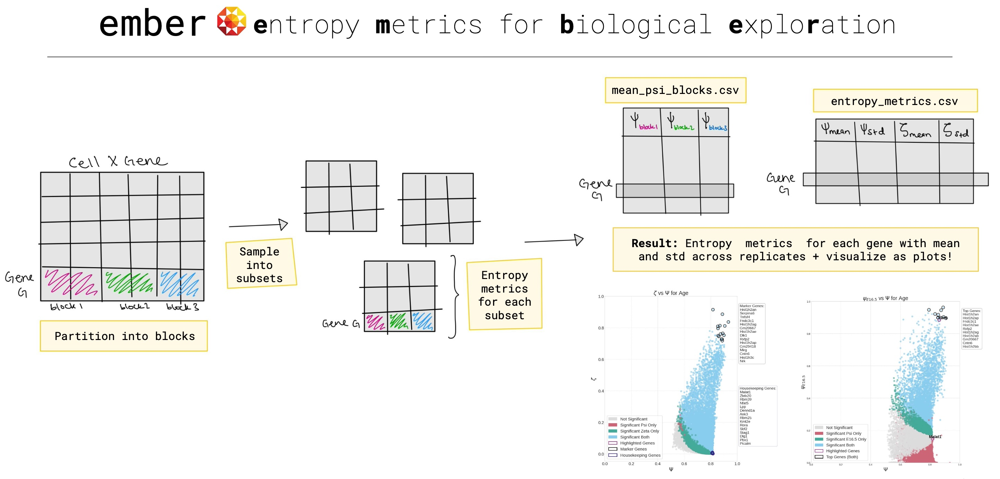

# ember
ember is a python and command line tool that can identify highly specific genes to a given partition (e.g., "Age", "Genotype", "Cell type")in high dimentional scRNAseq data. For an overview of how ember works refer to [the ember guide (slides)](./assets/ember_guide.pdf).

<p align="center">
  
</p>

For a hands on tutorial, check out this [collab notebook](https://colab.research.google.com/drive/1OSMu27FiXWf1a1KFhAZ0fnbgMtLbH9YU?usp=sharing).

## Installation
You can install the package using pip:

```bash
pip install ember
````

## Documentation

For more detailed information, refer to the [official documentation](./assets/ember_documentation.pdf).


## License

This project is licensed under the [MIT License](./LICENSE).

